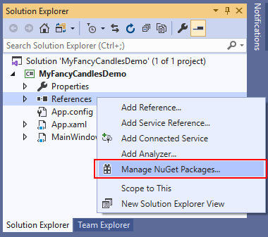
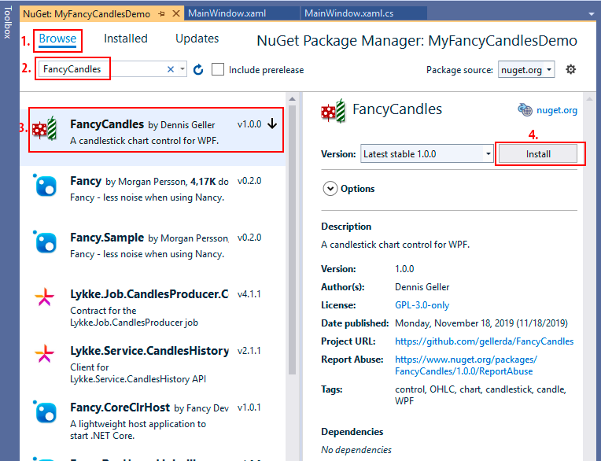
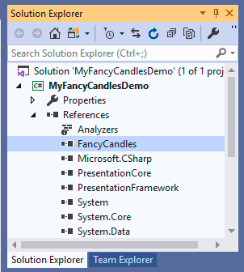
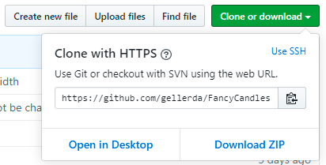
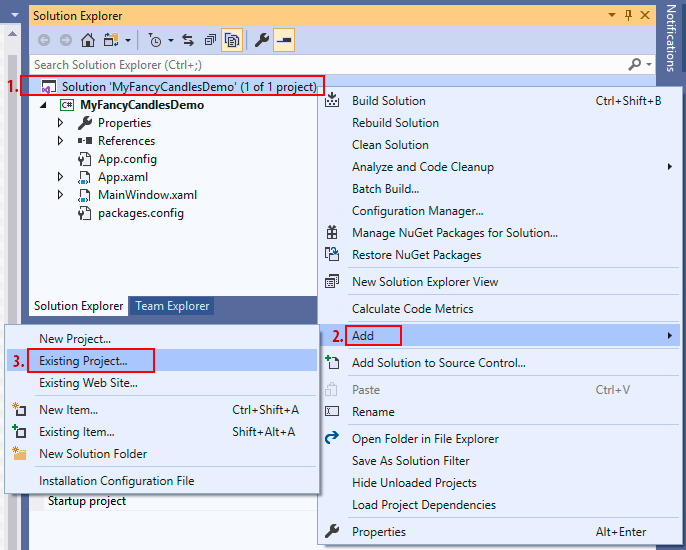
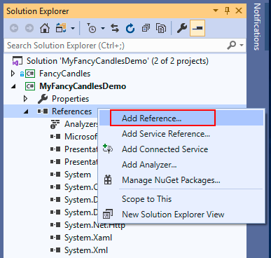
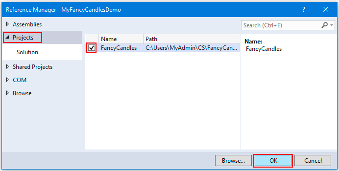

# Consuming FancyCandles in your WPF (.NET Framework) project
To use the FancyCandles library in your project you have two options:

 &nbsp;&nbsp;&nbsp;&nbsp;&nbsp;&nbsp;**A) To [install the FancyCandles NuGet package](#nuget_package) in your project.** 
 &nbsp;&nbsp;&nbsp;&nbsp;&nbsp;&nbsp;**B) To [add the FancyCandles project](#add_project) to your solution.**

If you are planning to change the source code of the FancyCandles library for your specific needs or to contribute to its open source project, then your choice is **B**.
Otherwise, you don't need to be able to change the source code of the FancyCandles library, and your choice is **A**.

# A) Installing FancyCandles NuGet package in your project
1. In Visual Studio **Solution Explorer**, right-click on **References** of your project and select **Manage NuGet Packages....**  

1. In **NuGet Package Manager** select the **Browse** tab and type *FancyCandles* in the search box. Select **FancyCandles** from the list of filtered packages. Select a desired version of the FancyCandles package (the latest is recommended) and click the **Install** button.  

1. Accept a license prompt.

1. If everything went successfully, Visual Studio installs the FancyCandles package into your project. Once the installation is complete, the FancyCandles package appears on the **Installed** tab of **NuGet Package Manager**, and in the **References** list of your project in **Solution Explorer**.  

Now you can go on to [create your first FancyCandles candlestick chart](creating_candlestick_chart.md) in your application.

# B) Adding FancyCandles project to your solution

1. Clone or Download the [FancyCandles repository](https://github.com/gellerda/FancyCandles) to your computer.  
    

1. Add the FancyCandles project to the solution of your project, which going to use the candlestick chart control:
    * In **Solution Explorer**, right-click on the Solution of your project and select **Add/Existing project...**.  
      
    * Select a path to the project file **FancyCandles.csproj** of the FancyCandles project (eg. *.../FancyCandles/FancyCandles.csproj*) and click **Open**.  

1. Add to your project a reference to the FancyCandles project:
    * Right-click on **References** under your project in **Solution Explorer** and click **Add reference...**.  
      
    * In the **Projects** tab find the **FancyCandles** project row and check it. Click **OK**.  
     

Now you can go on to [create your first FancyCandles candlestick chart](creating_candlestick_chart.md) in your application.
