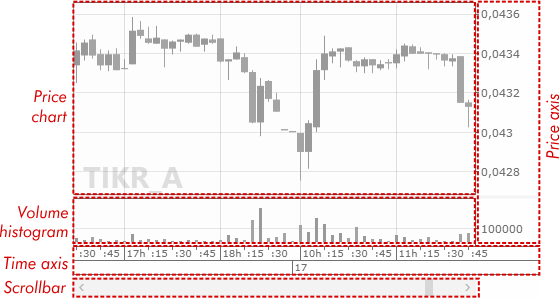
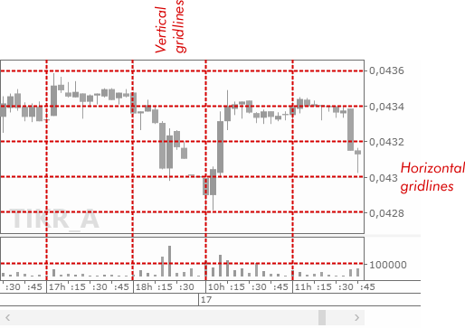
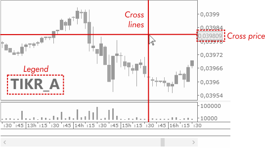
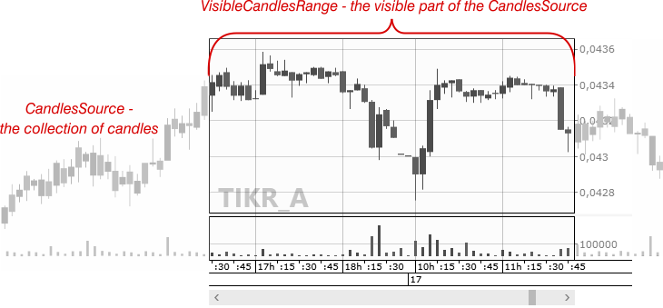

# Overview
The [CandleChart](xref:FancyCandles.CandleChart) control consists of the following main components:

## Price chart
The price chart is a central component of the [CandleChart](xref:FancyCandles.CandleChart) control.

Some related properties: [ChartAreaBackground](xref:FancyCandles.CandleChart.ChartAreaBackground), [PriceChartBottomMargin](xref:FancyCandles.CandleChart.PriceChartBottomMargin), [PriceChartTopMargin](xref:FancyCandles.CandleChart.PriceChartTopMargin), [BullishCandleBrush](xref:FancyCandles.CandleChart.BullishCandleBrush), [BearishCandleBrush](xref:FancyCandles.CandleChart.BearishCandleBrush), [CandleWidth](xref:FancyCandles.CandleChart.CandleWidth), [InitialCandleWidth](xref:FancyCandles.CandleChart.InitialCandleWidth), [GapBetweenCandles](xref:FancyCandles.CandleChart.GapBetweenCandles), [InitialGapBetweenCandles](xref:FancyCandles.CandleChart.InitialGapBetweenCandles).

## Volume histogram
The volume histogram is optional and could be hidden.

Some related properties: [ChartAreaBackground](xref:FancyCandles.CandleChart.ChartAreaBackground), [IsVolumePanelVisible](xref:FancyCandles.CandleChart.IsVolumePanelVisible), [VolumeBarWidthToCandleWidthRatio](xref:FancyCandles.CandleChart.VolumeBarWidthToCandleWidthRatio), [VolumeHistogramBottomMargin](xref:FancyCandles.CandleChart.VolumeHistogramBottomMargin), [VolumeHistogramTopMargin](xref:FancyCandles.CandleChart.VolumeHistogramTopMargin), [BullishVolumeBarBrush](xref:FancyCandles.CandleChart.BullishVolumeBarBrush), [BearishVolumeBarBrush](xref:FancyCandles.CandleChart.BearishVolumeBarBrush).

## Time axis
The time axis contain ticks and its labels for time and date values. Starting from daily timeframe (and higher), the time axis contains only the ticks of date, and no of time.

Some related properties: [TimeTickFontSize](xref:FancyCandles.CandleChart.TimeTickFontSize), [TimeAxisHeight](xref:FancyCandles.CandleChart.TimeAxisHeight).

## Price axis
The price axis contain ticks and its labels for price and volume (if the volume histogram is visible) values. Since the volume labels locate inside the price axis area, their appearance is defined by the same properties as for the price labels. You can regulate the density of the labels by setting the [GapBetweenPriceTickLabels](xref:FancyCandles.CandleChart.GapBetweenPriceTickLabels) property.

Some related properties: [PriceTickFontSize](xref:FancyCandles.CandleChart.PriceTickFontSize), [PriceAxisWidth](xref:FancyCandles.CandleChart.PriceAxisWidth).

## Scrollbar
The scrollbar is bound to the [VisibleCandlesRange](xref:FancyCandles.CandleChart.VisibleCandlesRange) property and changes its [Start_i](xref:FancyCandles.CandleChartIntRange.Start_i) field. You can tune an appearance of the scrollbar.

Some related properties: [ScrollBarHeight](xref:FancyCandles.CandleChart.ScrollBarHeight), [ScrollBarBackground](xref:FancyCandles.CandleChart.ScrollBarBackground).

## Gridlines
The horizontal and vertical gridlines are bound to the ticks of the price axis and of the time axis respectively. You can hide the gridlines and tune their appearance.

Some related properties: [IsHorizontalGridlinesEnabled](xref:FancyCandles.CandleChart.IsHorizontalGridlinesEnabled), [IsVerticalGridlinesEnabled](xref:FancyCandles.CandleChart.IsVerticalGridlinesEnabled), [HideMinorVerticalGridlines](xref:FancyCandles.CandleChart.HideMinorVerticalGridlines), [HorizontalGridlinesPen](xref:FancyCandles.CandleChart.HorizontalGridlinesPen), [VerticalGridlinesPen](xref:FancyCandles.CandleChart.VerticalGridlinesPen).

## Legend
The Legend contains any text, describing this chart. You set it by your own, but usually it contains a ticker symbol (a name of the security) and a timeframe. For example: "AAPL", "GOOGL, M5", "BTC/USD, D" etc. The legend locates in the price chart area and could be horizontally and vertically aligned.

Some related properties: [LegendText](xref:FancyCandles.CandleChart.LegendText), [LegendFontSize](xref:FancyCandles.CandleChart.LegendFontSize), [LegendFontWeight](xref:FancyCandles.CandleChart.LegendFontWeight), [LegendForeground](xref:FancyCandles.CandleChart.LegendForeground), [LegendHorizontalAlignment](xref:FancyCandles.CandleChart.LegendHorizontalAlignment), [LegendVerticalAlignment](xref:FancyCandles.CandleChart.LegendVerticalAlignment), [LegendMargin](xref:FancyCandles.CandleChart.LegendMargin).

## Cross
The cross helps you visualize the current position of the mouse pointer, the correspondent time and price levels. You can separately disable or enable the cross lines and the cross price label on the price axis.

Some related properties: [CrossLinesBrush](xref:FancyCandles.CandleChart.CrossLinesBrush), [CrossPriceBackground](xref:FancyCandles.CandleChart.CrossPriceBackground), [CrossPriceForeground](xref:FancyCandles.CandleChart.CrossPriceForeground), [IsCrossLinesVisible](xref:FancyCandles.CandleChart.IsCrossLinesVisible), [IsCrossPriceVisible](xref:FancyCandles.CandleChart.IsCrossPriceVisible).

## Candles source and visible candles

The [CandlesSource](xref:FancyCandles.CandleChart.CandlesSource) property defines the candles data source of your chart. In most cases a chart window accommodates only a part of all candles. The [VisibleCandlesRange](xref:FancyCandles.CandleChart.VisibleCandlesRange) property defines the range of indexes of the candles that are currently shown in the chart window. This property is changed every time you scroll through the candles via the scrollbar, resize the chart window or change the number of visible candles via mouse wheel. But you can set it up directly via the property setter or via some special methods - [CenterOnDateTime()](xref:FancyCandles.CandleChart.CenterOnDateTime(System.DateTime)) or [SetVisibleCandlesRange()](xref:FancyCandles.CandleChart.SetVisibleCandlesRange(System.DateTime,System.DateTime)).

Besides scrollbar, you can use mouse wheel in conjunction with certain modifier key (defined by the [MouseWheelModifierKeyForScrollingThroughCandles](xref:FancyCandles.CandleChart.MouseWheelModifierKeyForScrollingThroughCandles) property) to scroll through the collection of candles. And you can use mouse wheel in conjunction with another modifier key (defined by the [MouseWheelModifierKeyForCandleWidthChanging](xref:FancyCandles.CandleChart.MouseWheelModifierKeyForCandleWidthChanging) property) to change the amount of candles currently visible in the chart window. The default values for this properties are [ModifierKeys.Control](https://docs.microsoft.com/ru-ru/dotnet/api/system.windows.input.modifierkeys?view=netframework-4.8) and [ModifierKeys.None](https://docs.microsoft.com/ru-ru/dotnet/api/system.windows.input.modifierkeys?view=netframework-4.8) respectively, i.e. you need to roll a mouse wheel with Ctrl to scroll through the candles, and to roll a wheel with no modifier to change the amount of visible candles. You can set up this modifier keys as you like.

See also: [CandlesSource](xref:FancyCandles.CandleChart.CandlesSource), [VisibleCandlesRange](xref:FancyCandles.CandleChart.VisibleCandlesRange), [CenterOnDateTime](xref:FancyCandles.CandleChart.CenterOnDateTime).

## Disabled mode

Disabling (the [isEnabled](https://docs.microsoft.com/ru-ru/dotnet/api/system.windows.uielement.isenabled?view=netframework-4.8) property is set to false) is essential for situations when your chart is waiting for some lengthy asynchronous operation, eg loading a new candles data collection from the internet, and you need to visualize this process by shading the chart and showing up some external busy indicator. You can set up the color and transparency of the covering shading layer for the whole control for the disabled mode.

See also: [DisabledFill](xref:FancyCandles.CandleChart.DisabledFill).
